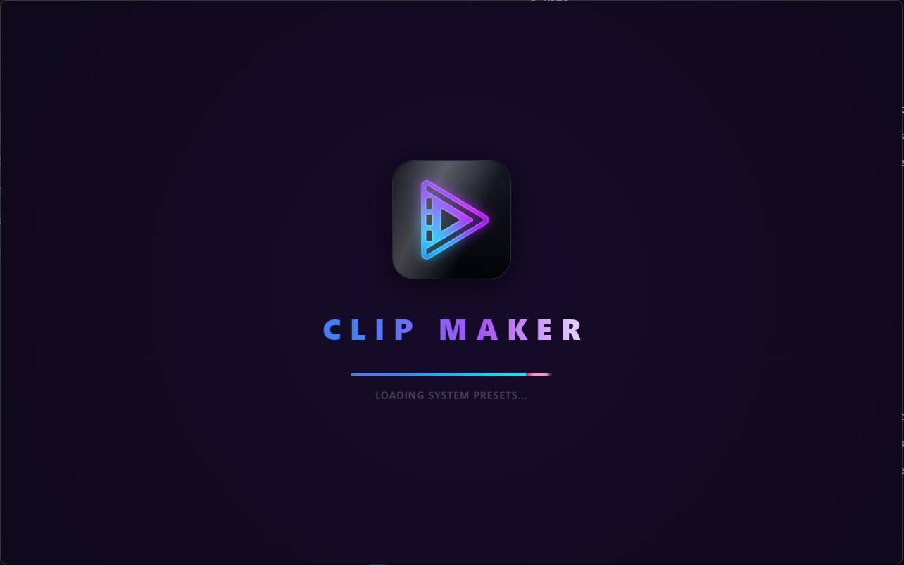
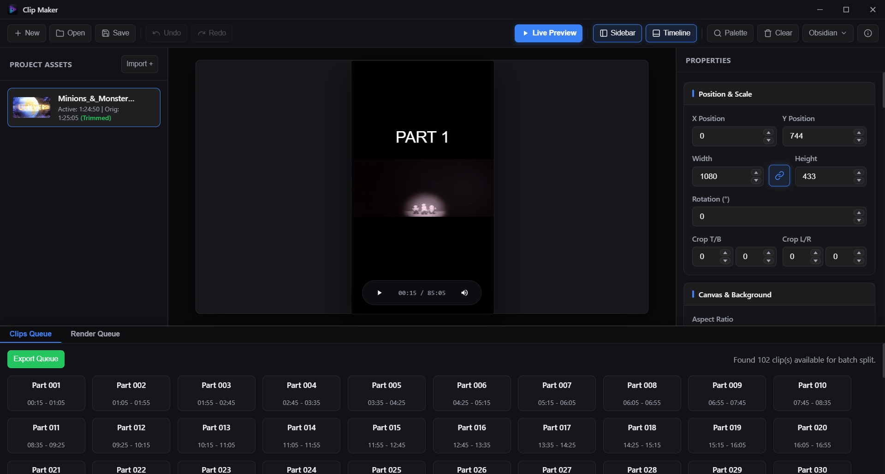
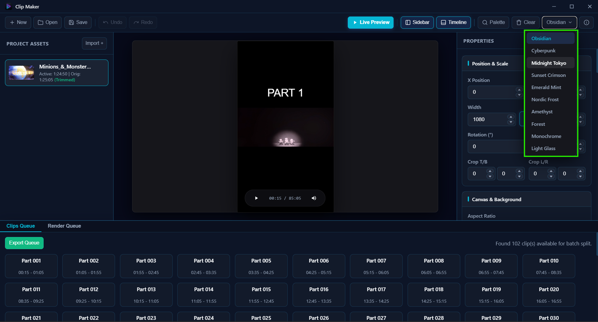
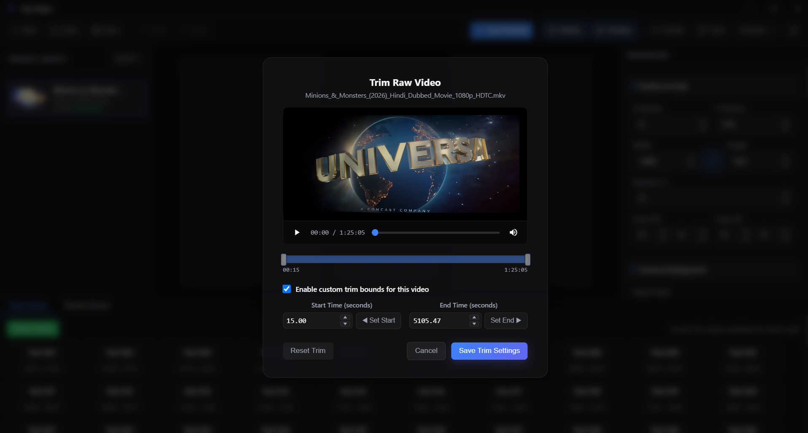
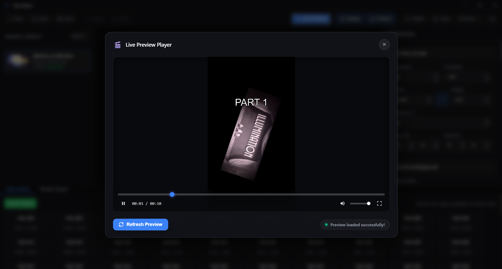

<p align="center">
  
</p>

<h1 align="center">🎬 Clip Maker</h1>

<p align="center">
  <strong>A high-performance desktop application to crop, split, overlay, and batch-render video clips for YouTube Shorts, TikTok, and Instagram Reels.</strong>
</p>

<p align="center">
  <a href="https://github.com/gautamcoder235/Clip-Maker/releases"></a>
  <a href="https://github.com/gautamcoder235/Clip-Maker/actions/workflows/ci.yml"></a>
  
  
  
  
  <a href="LICENSE"></a>
</p>

---

## 📥 Download

Pre-built binaries for Windows are available on the [**GitHub Releases**](https://github.com/gautamcoder235/Clip-Maker/releases) page:

- **NSIS Setup (.exe):** Recommended for most Windows users (auto-updating & desktop shortcuts).
- **Windows Installer (.msi):** Enterprise & clean machine installation.

👉 [**Download Latest Release (v1.3.5)**](https://github.com/gautamcoder235/Clip-Maker/releases/latest)


## ✨ Features

- **🎥 Automatic Video Splitting** — Import any long-form video and automatically split it into equal-duration clips (e.g., 50s parts) ready for short-form platforms.
- **📐 Aspect Ratio & Canvas Control** — Switch between 9:16 (vertical/Shorts) and 16:9 (horizontal) layouts with full control over canvas size, background color, and background images.
- **🖱️ Interactive Live Canvas** — Drag, resize, rotate, and crop your video placement directly on a WYSIWYG canvas with real-time visual feedback.
- **🔤 Dynamic Text Overlays** — Add customizable text overlays with system font picker, adjustable font size, weight/boldness, letter spacing, color, and outline stroke.
- **📝 Text Presets & Cycling** — Use `PART {part}` templates or cycle through multiple text presets automatically across clips in the queue.
- **🖼️ Media Overlays & Chroma Key** — Layer images, video stickers, or facecam overlays on top of your clips. Built-in chroma key (green screen removal) support.
- **✂️ Trim & Range Selection** — Precise start/end trim controls with interactive range slider and live video playback within the trim modal.
- **👁️ Instant Live Preview** — Generate a real-time FFmpeg preview of any selected clip directly inside the app, with audio, seek, and volume controls.
- **🚀 GPU-Accelerated Batch Export** — Render all clips in parallel using multi-threaded FFmpeg workers. Supports NVENC, AMF, and VAAPI hardware encoding for up to 10x faster exports.
- **📊 Render Queue Monitor** — Track real-time progress bars, completion timers, and detailed render logs for every clip in the batch.
- **💾 Project Save & Load** — Save your complete project configuration (layout, overlays, trim, text settings) as JSON and reload anytime.
- **🎨 10 Beautiful Themes** — Choose from Obsidian, Cyberpunk, Midnight Tokyo, Sunset Crimson, Emerald Mint, Nordic Frost, Amethyst, Forest, Monochrome, and Light Glass themes.
- **⌨️ Keyboard Shortcuts** — Full keyboard shortcut support including Command Palette (`Ctrl+K`), Undo/Redo, Save, and quick layout fitting.
- **🔊 Volume Controls** — Mute/unmute and volume slider available on both the main canvas player and the live preview modal.

---

## 📸 Screenshots

### Main Editor
> Full workspace with asset panel, interactive canvas, properties inspector, and clips queue.



### Theme Selector
> 10 stunning built-in themes to customize your editing experience.



### Trim Modal
> Precise video trimming with interactive range slider, volume controls, and live playback.



### Live Preview
> Instant FFmpeg-rendered preview of any clip with full playback controls.



---

## 🛠️ Tech Stack

| Layer | Technology |
|-------|-----------|
| **Framework** | [Tauri 2](https://tauri.app/) |
| **Backend** | Rust |
| **Frontend** | TypeScript, HTML, CSS |
| **Build Tool** | Vite |
| **Video Processing** | FFmpeg (via Rust CLI integration) |
| **Package Manager** | npm + Cargo |

---

## 🚀 Getting Started

### Prerequisites

- [Node.js](https://nodejs.org/) (v18+)
- [Rust](https://www.rust-lang.org/tools/install) (latest stable)
- [FFmpeg & FFprobe](https://ffmpeg.org/download.html) (must be available in PATH or placed in `src-tauri/binaries/`)
- [Tauri CLI](https://tauri.app/start/) (`npm install -g @tauri-apps/cli`)

### Installation & Development

```bash
# Clone the repository
git clone https://github.com/gautamcoder235/Clip-Maker.git
cd Clip-Maker

# Install frontend dependencies
npm install

# Run in development mode
npm run tauri dev

# Build for production
npm run tauri build
```

> **FFmpeg Note for Contributors:** Clip Maker searches for `ffmpeg.exe` and `ffprobe.exe` either in your system `PATH` or inside the `src-tauri/binaries/` directory. For local development, ensure FFmpeg is installed or copy the binaries into `src-tauri/binaries/`.

The compiled installer will be available at:
- **MSI:** `src-tauri/target/release/bundle/msi/Clip Maker_1.3.5_x64_en-US.msi`
- **NSIS Setup:** `src-tauri/target/release/bundle/nsis/Clip Maker_1.3.5_x64-setup.exe`

---

## 📁 Project Structure

```
Clip-Maker/
├── index.html              # Main HTML layout
├── src/
│   ├── main.ts             # App entry point & event handlers
│   ├── styles.css           # Complete styling & themes
│   ├── types/index.ts       # TypeScript interfaces
│   └── editor/
│       ├── canvas.ts        # Canvas renderer (video + overlays)
│       └── dom_overlay.ts   # DOM-based overlay system (drag/resize)
├── src-tauri/
│   ├── src/
│   │   ├── lib.rs           # Tauri command registrations
│   │   ├── config/model.rs  # AppConfig data model
│   │   ├── ffmpeg/
│   │   │   ├── builder.rs   # FFmpeg command builder
│   │   │   ├── overlay.rs   # Text overlay filter generation
│   │   │   └── encoder.rs   # GPU encoder detection
│   │   └── services/
│   │       ├── export.rs    # Batch export pipeline
│   │       └── preview.rs   # Live preview generation
│   └── tauri.conf.json      # Tauri app configuration
├── screenshots/             # App screenshots for README
└── package.json
```

---

## ⌨️ Keyboard Shortcuts

| Shortcut | Action |
|----------|--------|
| `Ctrl + K` | Open Command Palette |
| `Space` | Toggle Play / Pause |
| `Ctrl + S` | Save Project |
| `Ctrl + O` | Open Project |
| `Ctrl + N` | New Project |
| `Ctrl + Z` | Undo |
| `Ctrl + Y` | Redo |
| `Ctrl + B` | Toggle Left Sidebar |
| `Ctrl + J` | Toggle Bottom Queue |
| `H` | Fit video horizontally |
| `V` | Fit video vertically |
| `Ctrl + D` | Deselect element |
| `Esc` | Close active modal |

---

## 👤 Author

**Gautam Sharma**

- GitHub: [@gautamcoder235](https://github.com/gautamcoder235)

---

## 🤝 Contributing

Contributions, issues, and feature requests are very welcome!
- Check out the [Contributing Guide](CONTRIBUTING.md) to get started.
- Review the [Code of Conduct](CODE_OF_CONDUCT.md).
- To report a security vulnerability, please refer to our [Security Policy](SECURITY.md).

---

## ⭐ Show Your Support

Give a ⭐ if you find this project useful!

---

## 📄 License

This project is licensed under the [MIT License](LICENSE).

