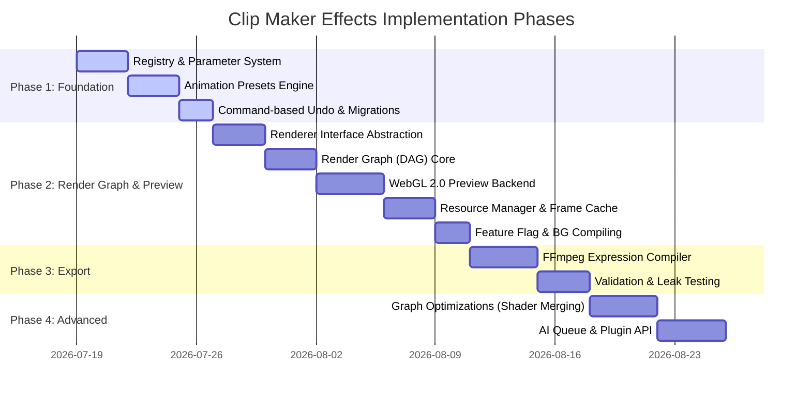

# Implementation Plan: Phase-Based Video Effects Subsystem for Clip Maker

This document establishes the phased implementation plan for Clip Maker's video effects, animation, and compositing pipelines, incorporating production-grade architecture principles.

---

## 1. Goal Description

Establish a production-ready, data-driven effects architecture in Clip Maker. This plan isolates database layouts from rendering logic, implements the **Render Graph** as the architectural core in Phase 2, and exposes a clean feature flag to run WebGL 2.0 rendering in parallel with the current positioning player during development.

---

## 2. Implementation Milestones

### Phase 1: Foundation (Zero Rendering Changes)
Establish data serialization, command history, and animation track evaluations.

1.  **Effect Registry & Parameter Metadata:**
    *   Implement metadata structures including units (`%`, `px`, `degrees`), precision scale, UI hints (`slider`, `color_picker`), sections, and reset values.
    *   Add **Effect Capabilities** flags: `supportsPreview`, `supportsExport`, `supportsRealtime`, `supportsAnimation`, `supportsMask`, `supportsGPU`, `supportsCPU`, `supportsAI`.
2.  **Animation Easing Subsystem:**
    *   Build a standalone animation track evaluator evaluating `Step`, `Linear`, `Ease In`, `Ease Out`, and `Ease In-Out` easing tracks.
3.  **Command-Based Undo/Redo Engine:**
    *   Refactor timeline state mutation to use the `Command` pattern (e.g. `AddEffectCommand`, `ChangeParameterCommand`) instead of simple snapshot snapshots.
4.  **Project Schema Versioning:**
    *   Introduce `projectVersion: 2` and a sequential migration runner.

---

### Phase 2: Render Graph & Preview Engine (Parallel WebGL 2.0 Sandbox)
Introduce WebGL 2.0 frame capture and composition graphs behind a feature flag.

1.  **Renderer Interface & Render Graph (DAG):**
    *   Define the abstract `RendererInterface` to separate the core application from WebGL code.
    *   Build the `RenderGraph` data structure containing decoupled logical nodes (`DecodeNode`, `EffectNode`, `BlendNode`, `MaskNode`, `CompositeNode`). The graph resolves frames from the Timeline.
2.  **WebGL 2.0 Sandbox Preview Backend (Feature Flagged):**
    *   Implement `WebGL2Renderer` implementing `RendererInterface`.
    *   Add feature flag check `enable_webgl_preview` to run this renderer in parallel.
3.  **GPU Resource Manager & Frame Cache:**
    *   Build a pool system to recycle WebGL textures and framebuffers.
    *   Add a WebGL texture Frame Cache to support paused playheads, reverse scrub loops, and single-frame stepping.
4.  **Background Shader Compilation:**
    *   Compile shaders in the background immediately when an effect is added (or at app launch) rather than waiting for the playhead to scrub.

---

### Phase 3: Export Engine & Mapping
Map animated parameters to FFmpeg command arguments.

1.  **Export Registry Mapper:**
    *   Map parameter states into one of: `NativeExpression`, `NativeFilter`, `SoftwareProcessing`, or `AIProcessing`.
2.  **FFmpeg Expression Builder:**
    *   Generate dynamic mathematical equations directly in FFmpeg filters (e.g. `eq=brightness='0.1 + (0.4 * t)'`) for GPU-style performance during exports.

---

### Phase 4: Advanced (Optimizations & Schedulers)
Extend the graphics pipeline to support advanced GPU scheduling and modular extension frameworks.

1.  **Graph Optimizations:**
    *   Implement **Shader Merging** inside the Graph Optimizer to link multiple simple fragment shaders together, bypassing intermediate framebuffers.
2.  **Frame Scheduler:**
    *   Introduce queues (`GPUQueue`, `CPUQueue`, `AIQueue`) to ensure slow AI execution does not lock up preview scrub loops.
3.  **Plugin API:**
    *   Expose plugin registrar bindings.

---

## 3. Verification & Stability Plan

*   **Context Loss Recovery:** Verify shaders recompile and bind textures on `webglcontextlost` simulation.
*   **Leak Detection:** Track WebGL resource allocation.
*   **Project Migration Round-Trips:** Ensure project files upgrade, load, and serialize without version drift.
*   **State History Integrity:** Verify commands undo/redo back to matching MD5 timeline states.
