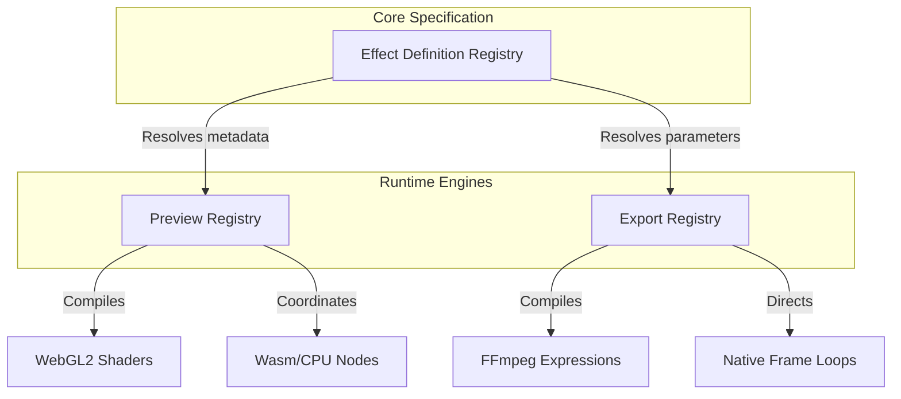

# Clip Maker: Production-Grade Render Graph & Video Effects System Specification

This document defines the production-grade, highly optimized architecture for the video/image effects, animation, and compositing pipelines of **Clip Maker**. This design decouples timeline composition, render graph execution, live preview rendering, and export compilation to guarantee stability, modularity, and 60 FPS performance.

---

## 1. Core Decoupled Architecture

Clip Maker splits editing, composition, rendering, and resource allocation into distinct, decoupled subsystems. This mirrors the design of professional desktop non-linear editors (NLEs).

```
[Timeline (Tracks & Clips)]
            │
            ▼
[Composition Graph (Logical Arrangement)]
            │ (Resolved per frame)
            ▼
[Render Graph (Dynamic DAG of Images)]
            │
            ▼
[Frame Scheduler] ──► [GPU Resource Manager] (Pools & Caches)
            │
    ┌───────┴────────┐
    ▼                ▼
[Preview Renderer] [Export Compiler]
(WebGL2 Interface)  (FFmpeg Expressions)
```

---

## 2. Decoupled Graphs: Timeline vs. Render

To prevent logical editing operations from polluting rendering performance, Clip Maker maintains two independent graph networks:

### A. Timeline Graph (Editing State)
Tracks user-facing layout arrangements: clips, transitions, volume sliders, track tracks, and raw project structures.
*   **Representation:** Hierarchical list of tracks containing clips with start/duration times.
*   **Purpose:** Serialization to project file, undo/redo history, and UI timeline editor state.

### B. Render Graph (Execution State)
A Directed Acyclic Graph (DAG) generated on-the-fly from the Timeline Graph at the current playhead position.
*   **Representation:** Render Nodes (Inputs, Output, Effects, Compositors).
*   **Purpose:** Frame rendering and shader execution.
*   **Nodes:**
    *   `DecodeNode` (Fetches video frame)
    *   `EffectNode` (Applies a stack of reorderable filters)
    *   `BlendNode` (Blends two inputs using blend modes)
    *   `MaskNode` (Applies alpha/luma masks)
    *   `CompositeNode` (Composites multiple tracks)

---

## 3. Decoupled Triple-Registry Architecture

To avoid runtime lookup overhead, Clip Maker registers metadata, preview engines, and export engines independently.



### A. Effect Definition Registry
Defines metadata, parameter metadata (including soft/hard limits, precision, slider formats), and capabilities.

#### TypeScript Typings (`src/types/effects/definition.ts`)
```typescript
export type ParameterType = 
  | 'number' 
  | 'boolean' 
  | 'color' 
  | 'string' 
  | 'enum'
  | 'vec2' 
  | 'vec3' 
  | 'vec4' 
  | 'matrix4' 
  | 'curve' 
  | 'gradient' 
  | 'lut';

export interface ParameterMetadata {
  id: string;
  name: string;
  type: ParameterType;
  tooltip?: string;
  unit?: string;
  category?: string;
  defaultValue: any;
  softMin?: number;
  softMax?: number;
  hardMin?: number;
  hardMax?: number;
  precision?: number;
  sliderStyle?: 'default' | 'percentage' | 'angle' | 'logarithmic';
  options?: { value: string; label: string }[];
  supportsAnimation: boolean;
  supportsExpressions: boolean;
  supportsReset: boolean;
}

export interface EffectCapabilities {
  supportsPreview: boolean;
  supportsExport: boolean;
  supportsRealtime: boolean;
  supportsAnimation: boolean;
  supportsMask: boolean;
  supportsGPU: boolean;
  supportsCPU: boolean;
  supportsAI: boolean;
}

export interface EffectDefinition {
  id: string;
  displayName: string;
  category: 'transform' | 'color' | 'blur' | 'sharpen' | 'stylize' | 'distortion' | 'keying' | 'lighting' | 'utility';
  icon: string;
  parameters: ParameterMetadata[];
  capabilities: EffectCapabilities;
  pluginId?: string;
}
```

### B. Preview Registry (Renderer Interface)
WebGL implementation abstraction. Shaders are compiled in the background when the effect is registered/added, avoiding playhead stalls.

```typescript
export interface RendererInterface {
  initialize(canvas: HTMLCanvasElement): Promise<void>;
  createTexture(width: number, height: number, data?: TexImageSource): WebGLTexture;
  compileShader(id: string, fragmentSource: string): WebGLProgram;
  draw(time: number, renderGraph: RenderGraph): void;
}
```

### C. Export Registry (FFmpeg & Software Builders)
Maps effects to optimized FFmpeg filter graph expressions (e.g. `eq=brightness='0.1 + sin(t)'`) where possible, or routes to custom frame loop handlers.

---

## 4. Reusable GPU Resource Manager & Frame Cache

### A. GPU Resource Manager
Manages WebGL allocations to prevent frame stuttering and memory leaks during scrub operations:
*   **Texture Pool:** Reuses WebGL textures of matching dimensions rather than reallocating.
*   **Framebuffer Pool:** Recycles framebuffers used during intermediate rendering passes.
*   **Shader Cache:** Holds compiled programs.
*   **Uniform Cache:** Avoids redundant GPU updates if uniform values do not change.

### B. Frame Cache
Stores decoded video frames and intermediate processed textures. This provides smooth playback during paused states, reverse scrubbing, and single-frame stepping.

---

## 5. Standalone Animation & Command-Based History

### A. Reusable Animation Tracks
Keyframe curves are decoupled from effect state and bound via target paths:

```typescript
export interface AnimationBinding {
  trackId: string;
  targetPath: string; // e.g. "clips/clip_123/effects/blur/radius"
}
```

### B. Command-Based Undo/Redo
Every action is stored as a concrete command object rather than a project snapshot:

```typescript
export interface Command {
  execute(): Promise<void>;
  undo(): Promise<void>;
  description: string;
}
```

---

## 6. Execution Scheduling

To prevent complex processing (such as AI background segmentation) from blocking preview responsiveness, a **Frame Scheduler** prioritizes rendering queues:

```
[Frame Scheduler]
       │
       ├─► [GPU Queue] (Real-time previews)
       ├─► [CPU Queue] (Wasm filters)
       └─► [AI Queue]  (Background models - asynchronous overlays)
```
*   The GPU preview displays immediate frames, inserting temporary placeholders or historical cached data if an asynchronous AI task is still running.

---

## 7. Categorized Effect Roadmap

1.  **Transform:** Crop, Scale, Rotate, Perspective, Mirror, Flip.
2.  **Color:** Brightness, Contrast, Exposure, Gamma, Temperature, Saturation, Curves, LUT.
3.  **Blur & Sharpen:** Gaussian Blur, Box Blur, Motion Blur, Unsharp Mask, Edge Enhance.
4.  **Stylize:** Film Grain, Noise, Pixelate, Glitch, Vignette.
5.  **Keying & Lighting:** Chroma Key, Luma Key, Mask, Shadow, Outline.
